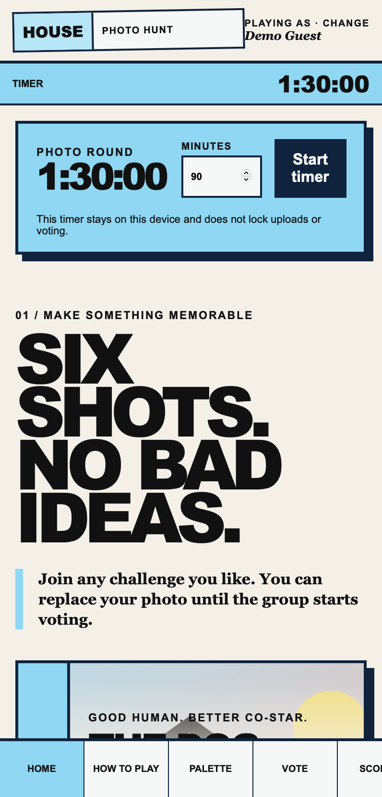
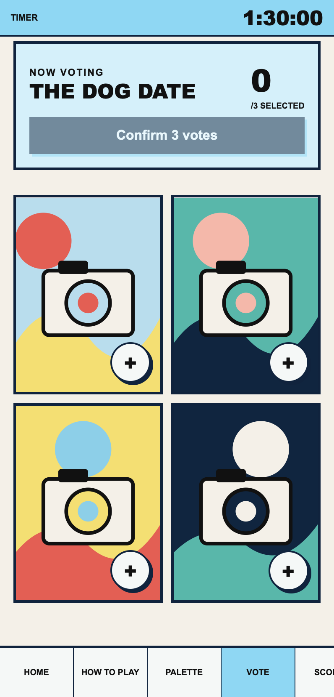
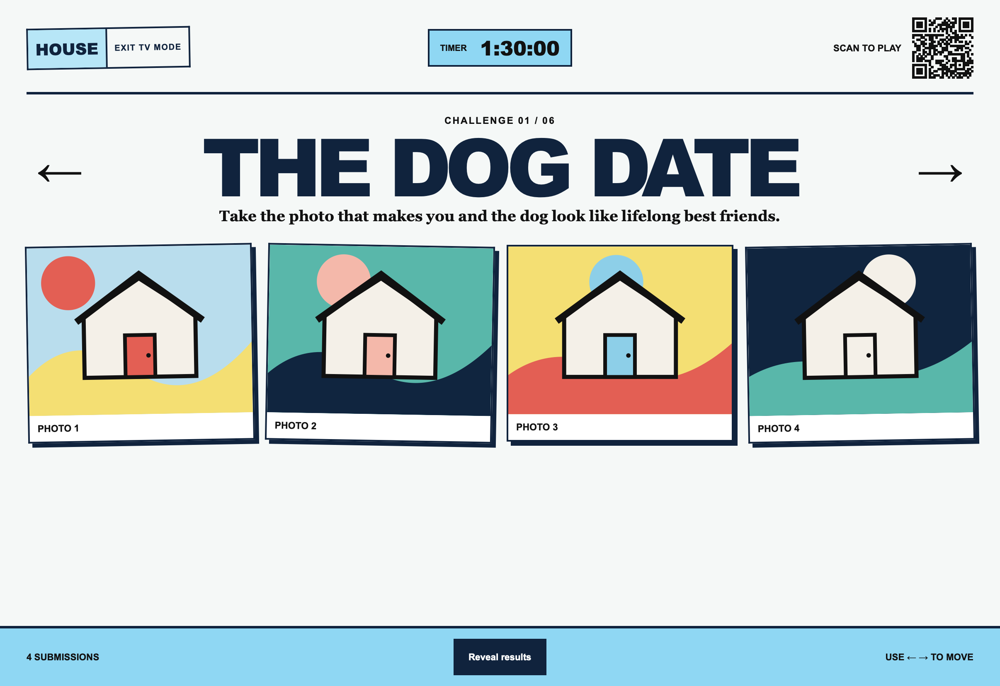
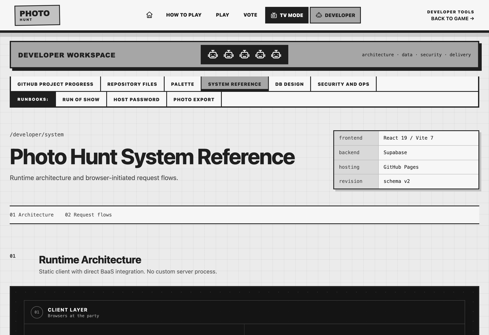
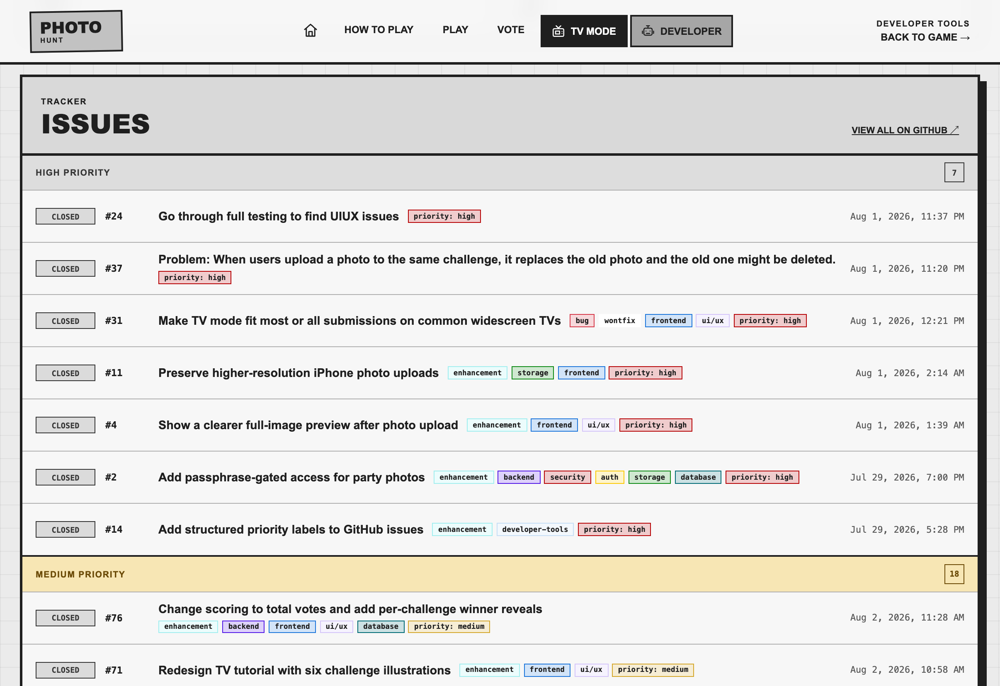

# House Party Photo Hunt

<p align="center">
  
</p>

A mobile-first housewarming photo challenge with passphrase-gated entry, anonymous guest profiles, direct photo uploads, up-to-three-vote rounds, TV presentation mode, and a live 3-2-1 leaderboard.

The frontend is React, TypeScript, and Vite on GitHub Pages. Supabase provides anonymous authentication, PostgreSQL, private photo storage, and realtime updates. No application server or Vercel deployment is required.

**[Try the live demo](https://leoncheng.dev/vibe-photo-voting-house-game/)**

## Screenshots

### Guest experience

<p align="center">
  
  
</p>

### TV mode



### Leaderboard


### Developer reference




### GitHub project priorities



## Features

- Passphrase-gated party membership enforced by Postgres row-level security
- Six included housewarming photo challenges
- One replaceable photo per guest per challenge
- In-browser photo resizing before upload
- Up to three equal votes for distinct photos; self-voting allowed
- TV-only 3-2-1 podium scoring with competition ranking for ties
- Informational, device-local timer configured from TV mode
- Built-in tutorial walkthrough for first-time guests
- Developer references for the color palette, architecture, database design, security and operations, repository files, and GitHub project progress, plus run-of-show, host password, and photo export runbooks under `/developer/`
- Anonymous photographer names during voting
- TV mode with Gallery, Voting, and How to Play pages, QR join code, automatic 30-second gallery paging, keyboard navigation, result reveal, and a host-confirmed final scoreboard
- Full-resolution HEIC/JPEG originals preserved alongside optimized game copies
- Always-visible storage meter against the Supabase Free 1 GB quota
- One-click originals export to a local ZIP (folder per challenge) with a pre-download tree preview on the Photo Export Runbook page
- Responsive layout for phones, laptops, and large televisions

The public landing page is served at `/`. Guests play at `/play/`; legacy `/home/` links redirect to the matching game view.
Primary views are deep-linkable at `/play/`, `/play/?tutorial`, `/play/?vote`, and `/play/?display`; in-app navigation keeps the address bar and browser Back/Forward history synchronized.

## Supabase Setup

1. Create a project on [Supabase](https://supabase.com/).
2. Open **Authentication > Providers > Anonymous Sign-Ins** and enable anonymous sign-ins.
3. Apply the migrations in `supabase/migrations/` once, in numeric order. Either:
   - **Supabase CLI (preferred):** `supabase login`, `supabase link --project-ref <your-ref>`, then `supabase db push`. If earlier migrations were ever applied by hand, first baseline them with `supabase migration repair --status applied <versions>`.
   - **SQL Editor:** paste and run each file once, in numeric order:
     - `supabase/migrations/001_initial.sql`
     - `supabase/migrations/002_remove_challenges.sql`
     - `supabase/migrations/003_flexible_vote_count.sql`
     - `supabase/migrations/004_party_membership.sql`
     - `supabase/migrations/005_relax_passphrase_length.sql`
      - `supabase/migrations/006_photo_originals.sql`
      - `supabase/migrations/007_original_status.sql`
      - `supabase/migrations/008_allow_partial_ballots.sql`
      - `supabase/migrations/009_preserve_original_versions.sql`
4. Set the party passphrase in the SQL Editor. Nobody can join until this runs:

```sql
select set_party_passphrase('your-long-passphrase');
```

5. Open **Project Settings > API** and copy the project URL and publishable key.
6. Copy `.env.example` to `.env` and fill in those two public values:

```dotenv
VITE_SUPABASE_URL=https://your-project.supabase.co
VITE_SUPABASE_PUBLISHABLE_KEY=sb_publishable_your_key
```

The publishable key is designed for browser use. Never add a Supabase secret key or service-role key to this repository or the frontend environment.

Supabase limits anonymous sign-ups by IP; if the party will exceed 30 guests on one network, review the Auth rate limit before the event.

## Guest Identity And Display Names

Each guest identity belongs to one browser profile. Returning in the same browser keeps the same identity, submissions, and votes. Changing the display name updates that existing profile; it does not create a new guest or disconnect any game data.

Display names are unique after trimming spaces and ignoring letter case. For example, `Leon`, ` leon `, and `LEON` are treated as the same name. If another guest already uses that name, the app shows `That name is already taken.`

A separate guest needs a different browser or browser profile. Another tab or window in the same browser shares the existing identity. Clearing site data, logging out and leaving the party, changing devices, or using another browser creates a new anonymous identity that must re-enter the passphrase and choose an available name; the previous identity's submissions and votes remain in the game.

## Party Access

Guests must enter a shared passphrase before they can read or write anything, including photo bytes. The passphrase is validated inside Postgres against a bcrypt hash; the plaintext is never stored in the repository, JavaScript bundle, QR code, or database. Share it out of band — say it aloud or write it on a board at the party.

Host controls (run in the Supabase SQL Editor; the full runbook is on `/developer/host-runbook/`):

```sql
select set_party_passphrase('maple-otter-battery-42');  -- set or rotate (any non-empty value)
update party_settings set is_open = false;              -- close the party instantly
update party_settings set is_open = true;               -- reopen
delete from memberships;                                -- reset: everyone re-enters the passphrase
```

Rotating the passphrase does not remove existing members; deleting memberships does. Closing the party blocks all database and Storage requests immediately, including for existing members, without redeploying the site.

## Local Development

```bash
npm install
npm run dev
```

Validation commands:

```bash
npm test
npm run lint
npm run build
```

See [`SCREENSHOT_CAPTURE_PLAN.md`](SCREENSHOT_CAPTURE_PLAN.md) for the privacy-safe, automated README screenshot workflow.

## GitHub Pages Deployment

1. In the GitHub repository, open **Settings > Secrets and variables > Actions**.
2. Add repository secrets named `VITE_SUPABASE_URL` and `VITE_SUPABASE_PUBLISHABLE_KEY`.
3. Open **Settings > Pages** and select **GitHub Actions** as the source.
4. Push to `main`, or manually run the **Deploy to GitHub Pages** workflow.

The app deploys to:

<https://leoncheng.dev/vibe-photo-voting-house-game/>

## Party Flow

1. Put the `/play/` URL or TV mode QR code where guests can find it, and share the party passphrase out of band.
2. Each guest enters the passphrase, then a unique display name, and takes one photo for every challenge. The TV device enters the passphrase once too.
3. Start the informational timer on the display device. It does not lock app actions.
4. When photo time ends, show the challenges in TV mode, which advances every 30 seconds.
5. Guests select and confirm one, two, or three photos for that challenge on their phones. They may revisit and replace a saved ballot.
6. Reveal that challenge's vote totals and photographers on the TV.
7. Continue through all challenges, then use **Reveal final scores** in the TV Voting footer to show the winners.

Use the left and right arrow keys in TV mode to switch challenges early and restart the 30-second countdown. Press the logo or Escape to leave TV mode.

## Capacity

Supabase Free currently includes 1 GB file storage and 5 GB egress per project (shared across all Storage buckets). Every active submission has one game copy and one or more retained original versions:

- **Game copy** (`photos` bucket): a JPEG resized to at most 2400 pixels on its longest side, adaptively compressed toward ~1.5 MB and always below the bucket's 5 MiB limit. New copies use immutable `{user_id}/{challenge_id}/{version}.jpg` keys; `submissions.storage_path` selects the active one.
- **Original versions** (`photo-originals` bucket): the untouched HEIC/JPEG capture when it is 6 MiB or smaller. Larger captures are optimized client-side below 6 MiB at full resolution, and other formats are converted to full-resolution JPEG. Replacing a submission adds an immutable version; participant actions never delete earlier originals.

Budget estimate for 20 guests × 6 challenges (120 submissions) with no replacements: roughly 720 MB of originals plus up to 180 MB of game copies — near the 1 GB quota. Every replacement creates immutable original and game paths; only originals enter the ZIP, while the runbook can safely identify superseded derived JPEGs for host cleanup. The storage meter turns yellow at 75% and red at 90%.

Egress adds up too: every guest device downloads every game copy, and each originals export downloads that challenge's originals once. Avoid repeated full exports and unnecessary page reloads on the party network.

### Original Photo Export

Any active party member can download every physically stored original version as one ZIP from **Developer → Photo Export Runbook** (`/developer/photo-export/`) on a desktop browser. The preview labels current, superseded, and recovery copies; `manifest.json` records each version ID, state, current status, upload time, provenance, and Storage path. Participant replacement and upload failures never clean up original bytes. After verifying and backing up the ZIP, only the host uses the runbook SQL and Storage dashboard to approve, detach, delete, and tombstone exported versions.

Submissions made before the originals feature only have game copies. `scripts/backfill-legacy-originals.mjs` (run locally with the service-role key; see the script header) copies those JPEGs into `photo-originals` with `original_status = 'legacy'` so they are included in exports.

Before reusing the project, follow the coordinated database and Storage cleanup steps below.

## Event Cleanup

Submission records and Storage objects do not delete each other automatically. Do not delete a referenced file from the `photos` or `photo-originals` bucket by itself: the remaining submission can produce broken photo views or exports while still participating in voting and scoring.

For the routine mid-party flow — exporting originals and reclaiming their storage — follow the **Photo Export Runbook** on `/developer/photo-export/` instead of the steps below.

### Remove One Submission

1. Copy the active object's complete path from `submissions.storage_path`. Migrated paths may use `{user_id}/{challenge_id}.jpg`; new paths use `{user_id}/{challenge_id}/{version}.jpg`.
2. Confirm exactly one matching submission, and note its original path, before deleting anything:

```sql
select id, challenge_id, user_id, storage_path, original_path
from public.submissions
where storage_path = '<user-id>/<challenge-id>.jpg';
```

3. Delete that submission by its exact ID and path. Votes for it cascade automatically:

```sql
delete from public.submissions
where id = '<submission-id>'
  and storage_path = '<user-id>/<challenge-id>.jpg';
```

4. Delete the game copy from **Storage > photos**. Leave every `photo-originals` object in place for the versioned export workflow.
5. Verify that `public.submissions` and the game object are gone. Archived original versions remain until host cleanup.

Delete the database row first. If Storage deletion then fails, retrying leaves only an unreferenced object; deleting Storage first can leave a live submission with a missing image.

### Reset Submissions For Another Event

The following removes all submissions and votes while retaining guest profiles and display names:

```sql
delete from public.submissions;
```

Votes cascade from the deleted submissions. After the query succeeds, empty the `photos` bucket. Export and clean `photo-originals` only through the Photo Export Runbook so archived revision metadata remains coordinated with Storage.

To reset participant names as well, delete `public.profiles` instead; submissions and votes cascade, while append-only original-version metadata remains available for export. This does not delete users from Supabase Auth or memberships. Empty game copies separately and use the original cleanup runbook.
